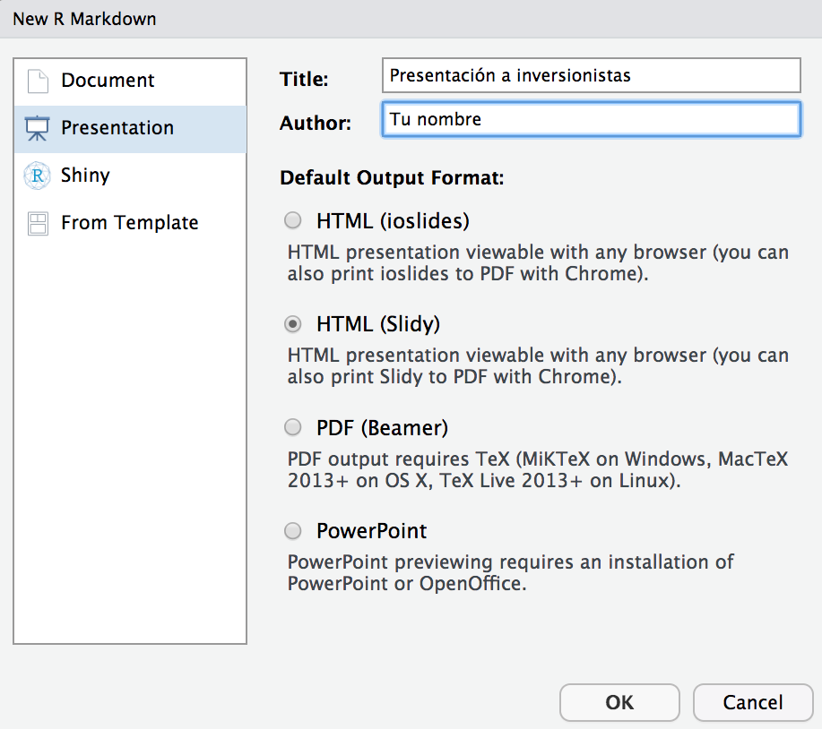

<style>
#TOC {
  color: black;
  font-familiy: Calibri;
  font-size: 14px;
  border-color: #708090; 
}
body {
   color: black;
   font-familiy: Calibri;
}

pre {
  color: black;
  background-color: #F8F8FF;
}
# header {
  color: #800000;
  font-familiy: Calibri;
  background-color: #F5F5F5;
  opacity: 0.8;
  font-size: 16px;
}
</style>

### **Introducción**

¿Qué es Rmarkdown?

[**Rmarkdown**](https://rmarkdown.rstudio.com/) es un procesador de texto que permite la creación de reportes, informes, documentos o presentaciones de alta calidad para sus usuarios o clientes. RMarkdown no sería posible de imaginar sin el desarrollo previo y la integración de varios **_software_** como **Markdown** y **YAML** o librerías de **R** como **knitr**.

**Markdown** es un lenguaje de marcado ligero creado por John Gruberis en 2004, con el se pueden elaborar fácilmente documentos en formato HTML, PDF y MS Word. Para más detalles de como trabajar con Markdown explore el siguiente link  <https://es.wikipedia.org/wiki/Markdown>.

[**_knitr_**](https://yihui.org/knitr/) es la librería clave sobre la cual **Rmarkdown** puede generar reportes dinámicos. **knitr** fue desarrollada por Yihui Xie en 2012 y su contribución a la investigación reproducible ha sido significativa.

**[YAML](https://es.wikipedia.org/wiki/YAML)** es un lenguaje simple de programación que permite describir datos. Se usa como herramienta para configurar el **metadata** de un reporte dinámico en Rmarkdown. 

**¿Cómo funciona?**

Respecto de un **_script_** tradicional de **R**, los script de Rmarkdown presentan tres diferencias: 

**1**. La extensión del archivo es **.Rmd**.

**2**. La codificación de la metadata está a cargo del software **YAML** y le indica a **knitr** no sólo que tipo de documento generar (Html, word, pdf, PPT); sino también, cual será el formato global y específico del documento (tamaño de letra, color, etc).

**3**. Los códigos se deben incluir en bloques, también llamados **Chunk**. Los chunk pueden tener un nombre identificador y mediante algunos argumentos específicos definir las características de ese bloque en particular, como por ejemplo, que el código se incluya o no en el reporte, o para agregar alguna leyenda a las figuras.


### **Objetivos de aprendizaje**

Los objetivos de aprendizaje de esta guía son:

**1**. Iniciar un proyecto de análisis de datos y escribir un código de programación o **_script_** con **[Rmarkdown](https://rmarkdown.rstudio.com/)**.

**2**. Buscar, instalar y habilitar librerías.

**3**. Elaborar reportes dinámicos con **Rmarkdown**.

#


### Repositorios clave para la busqueda de librerías

|  Repositorio | Descripción       |
|:-------------|:------------------|
| **[CRAN Packages By Name](https://cran.r-project.org/web/packages/available_packages_by_name.html)**           | CRAN Packages By Name permite buscar y acceder a las más de 17.000 librerías de **R** por su nombre para instalar de forma individual. |
| **[CRAN Task Views](https://cran.r-project.org/web/views/)** | Task views entrega una guía para realizar tareas en distintas disciplinas científicas agrupando diferentes librerías por tema, se instalan de forma agrupada. |
| **[Rseek](https://rseek.org/)**           | Rseek es una herramienta que permite buscar librerías por palabras clave; tanto dentro como por fuera del repositorio **CRAN**. Ésta aplicación fue desarrollada por Sasha Goodman de la Stanford university. |
| **[Bioconductor](https://www.bioconductor.org/)**           | Bioconductor es el gold standars para trabajar en análisis de datos genómicos |

### **Comandos**

 A continuación, se presentan algunos comandos que podrían ser usados para resolver los ejercicios de esta guía. Otros, los usará más adelante en el curso y los deberá investigar por su propia cuenta. 

* Este comando permite revisar que librerías están habilitadas en mi ambiente de trabajo.  

**search()**

* Este comando permite simultáneamente revisar las librerías que están instaladas en su estación de trabajo y cuando se agrega un nombre de una librería, la habilita en el ambiente de trabajo. 

**library()** # Para ver que librerías están instaladas.  

**library(BOD)** # Para habilitar una librería particular.  

* Este comando permite listar el total de librerías disponibles en **CRAN** (The Comprehensive R Archive Network).  

**available.packages()**

* Este comando permite instalar librerías en su estación de trabajo.  

**install.packages()**

## **Ejercicios**

### **Ejercicio 1.** **Conociendo un script de Rmarkdown**

Abra el archivo *Rmarkdown_example.R* disponible en Rstudio.cloud y revise su estructura.   

Note detalladamente la importancia de establecer con claridad los **metadatos** del script y como ahora están escritos en un formato diferente de un script de R tradicional, llamado **YAML**.    

Distinga el texto de bajo nivel o **markdown** de los bloques de códigos **chunk**. Tome un tiempo y discuta con sus compañeros cuál es la función de los comandos y argumentos que se incluyen en el ejemplo.

Para finalizar, compile el código con el botón **knit** e imprima diferentes reportes del mismo documento en formato pdf, html y word.

### **Ejercicio 2.** **Cree su propia presentación con Rmarkdown**

Una de las versatilidades de **Rmarkdown** es que puede pasar de análizar sus datos, a realizar una presentación profesional para sus usuarios o clientes sin necesidad de usar otro software. 

Ahora, cree su propio **_script_** para elaborar una presentación usando la barra de herramientas de **Rstudio**. Seleccione **File > New file > R Markdown** y utilice el siguiente ejemplo para completar la información de **metadatos**: Título, nombre del autor y formato HTML (Slidy).

```{r, echo=FALSE, out.width = '55%' }

```

Luego guarde inmediatamente su script como **script_2_nombre_apellido.Rmd**. Al finalizar la actividad deberá exportar y almacenar este **_script_** en su carpeta drive de tareas.

### **Ejercicio 3.** **Trabajando con Rmarkdown** 

**a).** Tómese un tiempo en reconocer la estructura del archivo. Identifique donde está el metadata de **YAML** y que tipo de output genera el script. Identifique el texto de bajo nivel y los bloques de código de la plantilla que Rstudio utiliza como ejemplo.

Note que la plantilla contiene 4 diapositivas identificadas con **##**:

**## R Markdown**  
**## Slide with Bullets**  
**## Slide with R Output**  
**## Slide with Plot**

**b).** Usando esta plantilla, elabore una presentación con el análisis de datos de las librerías **_rivers_** y **_BOD_** que realizó en la clase 2.

Incluya lo que usted estime que sea de importancia y utilidad para presentar. De ser necesario instale librerías, añada más diapositivas o bloques de código.

Use esta [Hoja de referencia](https://www.rstudio.com/wp-content/uploads/2015/03/rmarkdown-spanish.pdf) como ayuda para elaborar reportes Rmarkdown.

Use está guía de sintaxis de **Markdown** para mejorar el estilo de sus documentos [Rmarkdown](https://rstudio-pubs-static.s3.amazonaws.com/330387_5a40ca72c3b14824acedceb7d34618d1.html). 
