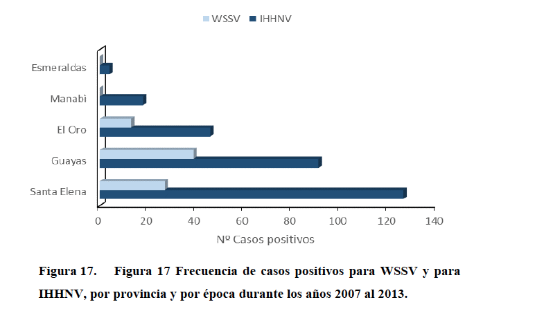
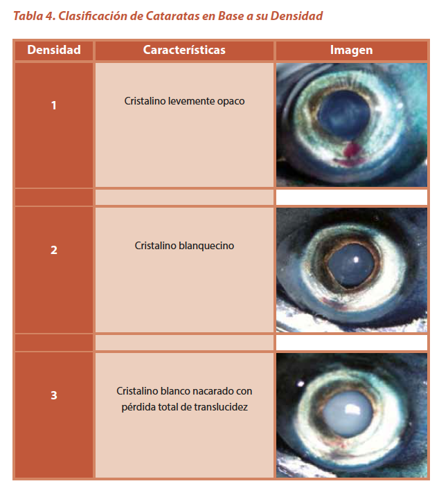
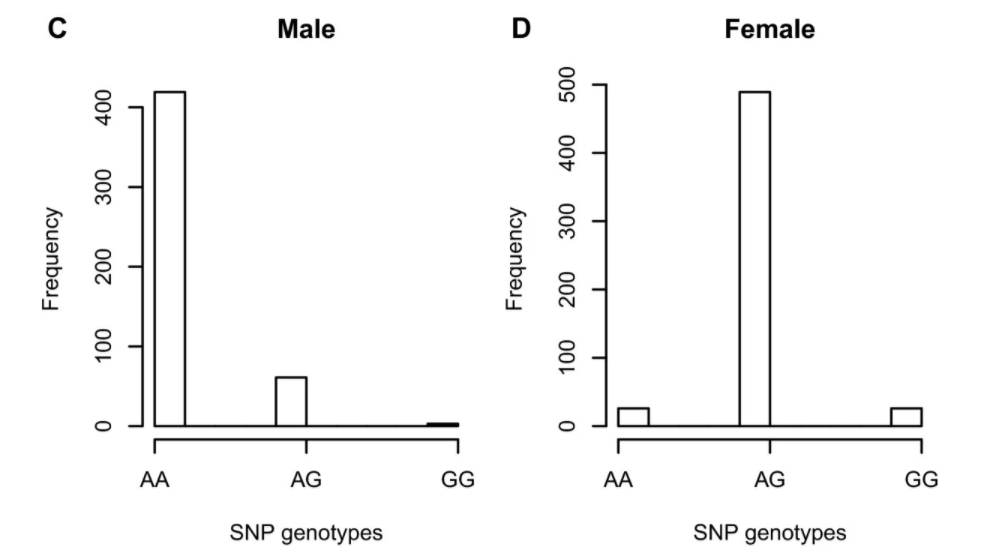
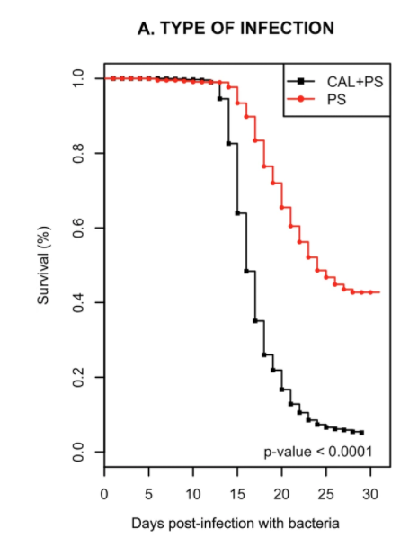
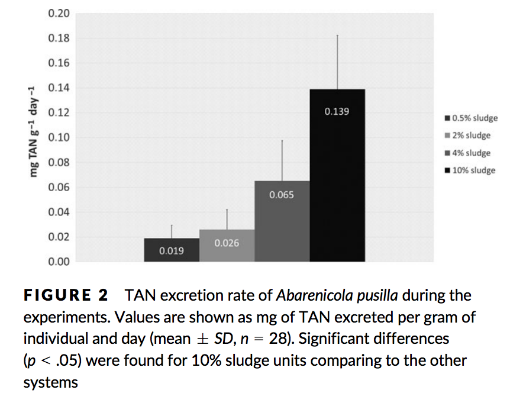
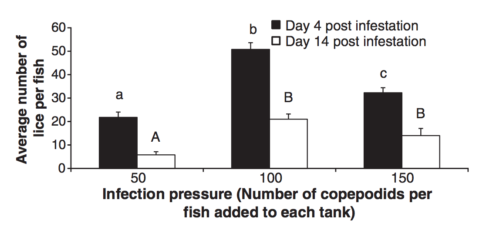
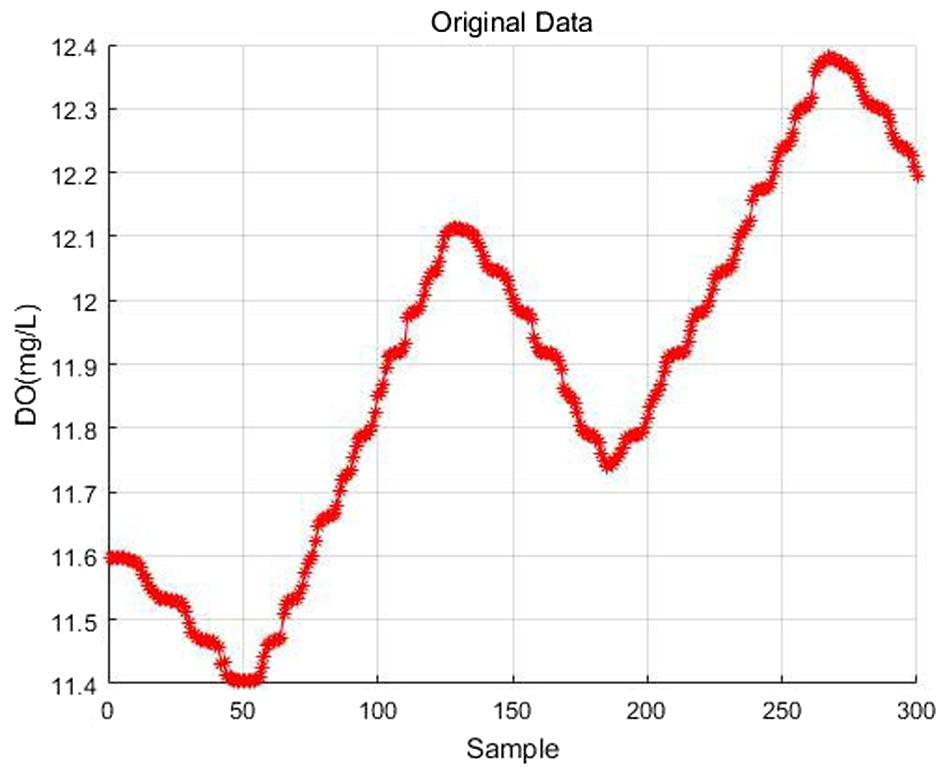

```{r setup, include=FALSE}
knitr::opts_chunk$set(echo = FALSE)
```

## Introdución
  
En el siguiente documento se reportan resultados de varios estudios de análisis de datos de acuicultura. Identifique para cada uno de ellos,

1.- ¿Cuál es la variable en estudio?  
2.- ¿Que tipo de variable aleatoria es?  
3.- ¿Tiene distribución normal?  

Responda en el documento compartido llamado *Clase_4_Actividad_de_aprendizaje* disponible en el Drive de la clase 4.

## Caso 1

- Tesis enfermedades del Camarón *Litopenaeus vannamei*. Rodriguez, 2016.

```{r, echo=FALSE, out.width = '100%' }

```

## Caso 2

- Informe etiología e Identificación de Cataratas. INTESAL, 2014.

```{r, echo=FALSE, out.width = '55%' }

```

## Caso 3

- Paper marcador genético asociada al sexo en camarón Tigre *Penaeus monodon*. Robinson, 2014

```{r, echo=FALSE, out.width = '90%' }

```

## Caso 4

- Paper efecto de coinfección en sobrevivencia de salmon del Atlántico. Figueroa, 2017

```{r, echo=FALSE, out.width = '50%' }

```

## Caso 5

- Paper biorremediación por poliquetos en sistema RAS. Gomez, 2018.

```{r, echo=FALSE, out.width = '90%' }

```


## Caso 6

- Paper infestación de salmón con caligus. Araya, 2012.

```{r, echo=FALSE, out.width = '100%' }

```


## Caso 7

- Paper Predicción del Oxigeno disuelto. Li, 2018.

```{r, echo=FALSE, out.width = '90%' }

```