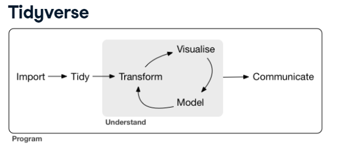
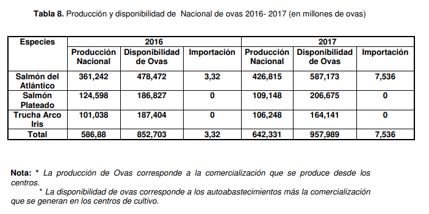

```{r setup, include=FALSE, message=FALSE}
knitr::opts_chunk$set(echo = TRUE)
library(dplyr)
library(readxl)
library(kableExtra)
library(knitr)
library(ggplot2)
```

## 
<div class="centered">
<div class="black">
**PLAN DE CLASE**
</div>
</div>

<div class="black">
**1).** **Introducción.**

- **Preguntas al curso.**

- **Estudio de caso.**

**2).** **Práctica con R y Rstudio cloud.**

- **Manipula y genera nuevas bases de datos y gráficos a partir de comandos de Tidyverse.**

- **Escribir un código de programación** o **_script_.**

- **Elaborar un reporte html con Rmarkdown.**

</div>
## {.flexbox .vcenter}
<div class="black">
<div class="centered">
**Introducción**

**_Clase 7 – Manipulación de bases de datos_**
</div>
</div>
## 
<div class="centered">
<div class="black">

**PREGUNTAS AL CURSO**
</div>
</div>

<div style="text-align: justify">
<div class="black">
**1).** **Señale 3 razones de la importancia de filtrar observaciones por algún criterio, hacer subconjuntos de datos y generar variables derivadas con información de variables existentes en el set de datos**.

**2).** **Desde su experiencia, comente sobre que tipo de herramientas ha usado en sus análisis de datos, para filtrar o generar subconjuntos de bases de datos**.

</div>
</div>

## 
<div class="centered">
<div class="black">

**ESTUDIO DE CASO**
</div>
</div>

<div class="black">
**¿Hay datos faltantes en el set de datos, si hay, cuántos son?**

**¿ Se podría en R sumar datos NA con números, come sería el resultado de adicionar estos tipos de datos?**

<div class="black">

## 
<div class="black">
<div class="centered">
**MANIPULACIÓN DE BASES DE DATOS**
</div>
</div>

<div class="black">
<div style="text-align: justify">
Es una de las etapas que más tiempo demanda antes de realizar el proceso de analizar los datos; ya que implica dar el formato adecuado a nuestro set de datos. Algunos aspectos a considerar a la hora de manipular bases de datos son:

* Aplicar filtros 

* Remover o imputar datos faltantes

* Usar agrupamientos por algún criterio

* Seleccionar variables

* Generar variables derivadas de la ya existentes 
</div>
</div>

<div class="black">
<div class="centered">
**_Una herramienta útil para la manipulación de datos es Tidyverse._**
</div>
</div>

## 
<div class="centered">
<div class="black">
**¿ CÓMO FUNCIONA LA MANIPULACIÓN DE BASES DE DATOS CON TIDIVERSE?**
</div>
</div>

```{r, echo=FALSE, out.width = '90%', fig.align='center', fig.cap= 'Figura tomada de DataCamp'}

```
</div>
</div>
## 
<div class="black">
<div class="centered">
**¿CÓMO MANIPULAR LOS DATA FRAMES?**
</div>
</div>

<div class="black">
<div style="text-align: justify">

El paquete **dplyr** del tidyverse posee funciones que realizan algunas de las operaciones más comunes cuando se trabaja con los **_data frames_**, permitiendo manipular de una forma ágil la base de datos que queremos analizar *a posteriori*. 

Veamos algunas **funciones claves**:

* Para cambiar la tabla de datos agregando una nueva columna, utilizamos **mutate()**. 

* Para filtrar la tabla de datos a un subconjunto de filas, utilizamos **filter()**. 

* Para subdividir los datos seleccionando columnas específicas, usamos **select()**.
</div>
</div>

## 
<div class="black">
<div class="centered">
**PRODUCCIÓN Y DISPONIBILIDAD NACIONAL DE OVAS 2016-2017**
</div>
<div style="text-align: justify">
El año 2017, la producción nacional de ovas aumentó en un 9% en relación al año 2016. El principal proveedor de ovas de salmónidos es Islandia. 
</div>

```{r, echo=FALSE, out.width = '80%',fig.align='center',fig.cap= 'Figura tomada de informe de Sernapesca'}

```

##
<div class="centered">
<div class="black">
**FILTRAR DATOS DE PRODUCCIÓN Y DISPONIBILIDAD NACIONAL DE OVAS DEL AÑO 2016**
</div>
</div>

<div class="centered">
<div class="black">
```{r, eval=FALSE}
filter(Year == 2016)
```
</div>
</div>

```{r table,echo=FALSE,align = "ccc"}
datos1 <- read_excel("Datos1.xlsx")
knitr::kable(datos1,digits = 2,caption = "Producción y disponibilidad de Nacional de ovas 2016-2017 (en millones de ovas).") %>%
kable_styling(bootstrap_options = "striped", full_width = F, font_size = 20) %>%
row_spec(1:3, bold = T, color = "white", background = "blue")
```

## 
<div class="centered">
<div class="black">
**AGRUPAR DATOS DE PRODUCCIÓN Y DISPONIBILIDAD NACIONAL DE OVAS PARA LOS AÑOS EVALUADOS**
</div>
</div>
<div class="centered">
<div class="black">
```{r, eval=FALSE}
group_by(Year)
```
</div>
</div>

```{r,echo=FALSE,align = "ccc"}
datos1 <- read_excel("Datos1.xlsx")
knitr::kable(datos1,digits = 2,caption = "Producción y disponibilidad de Nacional de ovas 2016-2017 (en millones de ovas).") %>%
kable_styling(bootstrap_options = "striped", full_width = F, font_size = 20) %>%
row_spec(1:6, bold = T, color = "white", background = "blue")
```

## 
<div class="centered">
<div class="black">
**SELECCIONAR VARIABLES DE LOS DATOS DE PRODUCCIÓN Y DISPONIBILIDAD NACIONAL DE OVAS**
</div>
</div>

<div class="centered">
<div class="black">
```{r, eval=FALSE}
select(Especies, Year,ProdNac)
```
</div>
</div>

```{r,echo=FALSE,align = "ccc"}

datos1 <- read_excel("Datos1.xlsx")
knitr::kable(datos1,digits = 2,caption = "Producción y disponibilidad de Nacional de ovas 2016-2017 (en millones de ovas).") %>%
kable_styling(bootstrap_options = "striped", full_width = F, font_size = 20) %>%
column_spec(1:3, bold = T, color = "white", background = "blue")
```

## 
<div class="centered">
<div class="black">
**MEDIDAS RESUMEN POR VARIABLE**
</div>
</div>

<div class="centered">
<div class="black">
```{r, eval=FALSE}
summarize(Min_ProdNac = min(ProdNac), Max_ProdNac = max(ProdNac))
```
</div>
</div>

```{r,echo=FALSE,align = "ccc"}

datos1 <- read_excel("Datos1.xlsx")
datos1 %>%
  summarize(Min_ProdNac = min(ProdNac), 
            Max_ProdNac = max(ProdNac))
```


```{r,echo=FALSE,align = "ccc"}

datos1 <- read_excel("Datos1.xlsx")
knitr::kable(datos1,digits = 2,caption = "Producción y disponibilidad de Nacional de ovas 2016-2017 (en millones de ovas).") %>%
kable_styling(bootstrap_options = "striped", full_width = F, font_size = 20) %>%
column_spec(3, bold = T, color = "white", background = "blue")
```

##
<div class="centered">
<div class="black">
**REPRESENTACIÓN GRAFICA USANDO GGPLOT2**
</div>
</div>

```{r, echo=FALSE, fig.width= 8, fig.align='center'}
datos1 <- read_excel("Datos1.xlsx")
ggplot(datos1, aes(x= DispOvas, y= ProdNac, color=Especies))+
   geom_point()+
  labs(y= "Producción Nacional", x= "Disponibilidad de Ovas",
       caption = "Fuente: Sernapesca")+
   expand_limits(y=0)+
   theme_bw()
```


## {.flexbox .vcenter}
<div class="black">
<div class="centered">
**Práctica**

**_Clase 7 – Manipulación de bases de datos_**
</div>
</div>

##
<div class="black">
<div class="centered">
**TRABAJO EN SALAS**

</div>
</div>

<div class="black">
**1).** **Guía de trabajo programación con R disponible en drive.**

**2).** **La tarea se realiza en Rstudio.cloud**. 

Ingresa al siguiente proyecto de **[Rstudio.Cloud](https://rstudio.cloud/spaces/135178/project/2447826/)** 

</div>


## 

<div class="centered">
<div class="black">

**RESUMEN DE LA CLASE**

</div>
</div>

<div class="black">

* Revisar ventajas de manipular bases de datos con **_Tidyverse_**.

* Escribir un código de programación con **_Rmardown_**

* Elaborar diferentes reportes dinámicos.

</div>


